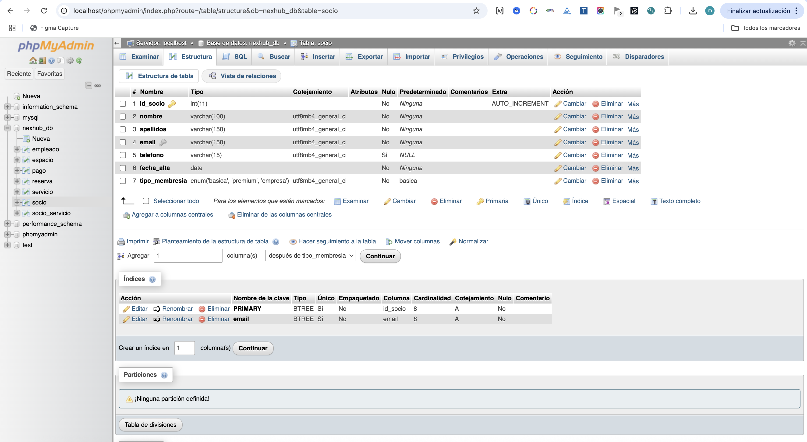
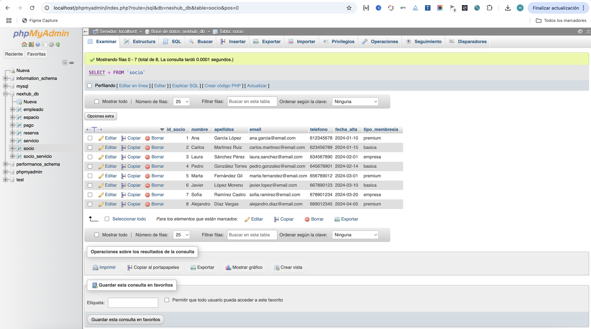
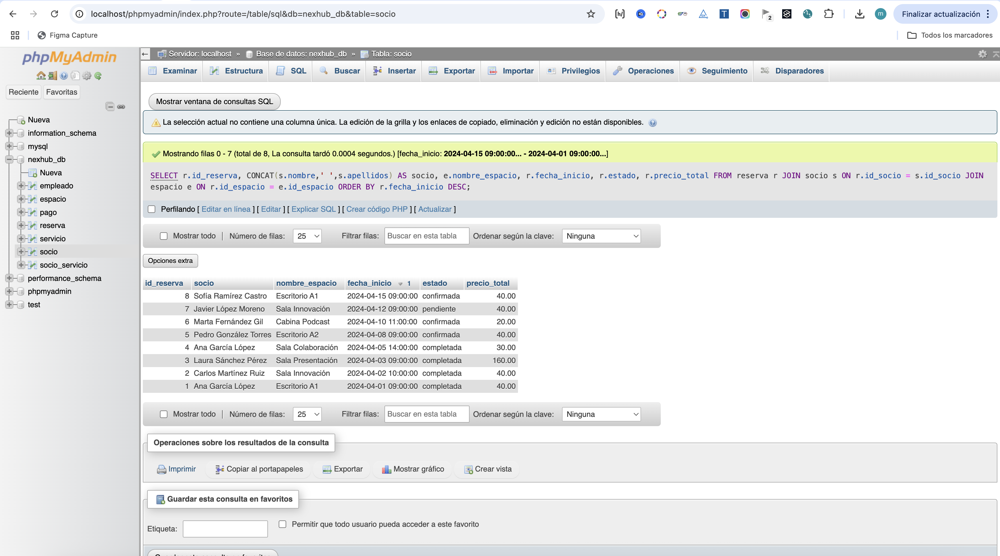

<div align="center">


# NexHub Coworking

**Sistemas Informáticos — Módulo 0483 · Miguel MOntes Vicente · 1º DAW · 2026**

</div>

---

Todo el proyecto corre en local. No hay ningún servidor externo: MySQL lo gestiona XAMPP, la aplicación Java se lanza desde IntelliJ y la web se abre directamente en el navegador con doble clic.

---

## Hardware utilizado

| Componente | Especificaciones |
|------------|-----------------|
| Equipo | MacBook Pro (macOS) |
| Procesador | Apple M1 o equivalente |
| RAM | 16 GB |
| Almacenamiento | 10 GB libres |

---

## Hardware mínimo

| Componente | Mínimo |
|------------|--------|
| Procesador | Intel Core i5 / Apple M1 o equivalente |
| RAM | 8 GB |
| Almacenamiento | 10 GB libres |
| Pantalla | 1280 × 800 px |

---

## Software instalado

| Programa | Versión | Para qué |
|----------|---------|----------|
| Java JDK | 24 (Corretto) | Compilar y ejecutar la aplicación |
| IntelliJ IDEA Community | Reciente | Entorno de desarrollo |
| XAMPP | 8.2.4 | MySQL local y phpMyAdmin |
| MySQL Connector/J | 9.x | Driver JDBC para conectar Java con MySQL |
| Google Chrome | Reciente | Navegador para la web |

---

## Cómo se instaló cada herramienta

**Java JDK 24**

Descarga desde oracle.com/java. En macOS se instala con el paquete `.pkg`. Para comprobar que funciona:
```
java -version
```

**IntelliJ IDEA Community**

Descarga desde jetbrains.com/idea. Se arrastra a la carpeta Aplicaciones. La edición Community es gratuita.

**XAMPP**

Descarga desde apachefriends.org. En macOS puede que el sistema lo bloquee la primera vez: hay que ir a Ajustes del sistema → Privacidad y seguridad → permitir XAMPP. Una vez abierto, se arrancan MySQL y Apache desde el panel Manage Servers.

**Driver JDBC**

Descarga desde dev.mysql.com/downloads/connector/j, opción Platform Independent. Se extrae el `.jar` y se añade en IntelliJ desde File → Project Structure → Libraries → + → Java.

---

## Usuarios

Un único usuario: el administrador, con acceso total. En XAMPP el usuario MySQL es `root` sin contraseña por defecto. En producción se crearía un usuario con permisos limitados solo a `nexhub_db`.

---

## Mantenimiento

Copia de seguridad de la base de datos: phpMyAdmin → seleccionar `nexhub_db` → Exportar → SQL → Guardar.

---

## Capturas del sistema funcionando

### 1. XAMPP activo

MySQL Database y Apache Web Server en estado Running.


---

### 2. Base de datos nexhub_db en phpMyAdmin

Las 7 tablas del proyecto visibles en el panel izquierdo: empleado, espacio, pago, reserva, servicio, socio, socio_servicio.


---

### 3. Estructura de la tabla socio

7 campos: id_socio (PK, AUTO_INCREMENT), nombre, apellidos, email (UNIQUE), telefono, fecha_alta y tipo_membresia.



---

### 4. Datos de la tabla socio

8 socios con distintos tipos de membresía: premium, basica y empresa.



---

### 5. Consulta JOIN en phpMyAdmin

Resultado de la consulta que une las tablas reserva, socio y espacio ordenado por fecha de inicio descendente.



---

### 6. Menú principal de la aplicación Java

La aplicación arranca, establece la conexión con nexhub_db y muestra el menú principal con las cuatro opciones de gestión.


---

### 7. Listado de socios desde consola

El administrador entra en Gestión de Socios y ejecuta Ver todos los socios. La aplicación consulta MySQL y muestra los 9 registros en tabla.


---

### 8. Web en el navegador

La página de inicio de NexHub abierta en Chrome directamente desde el archivo `index.html`, sin servidor.


