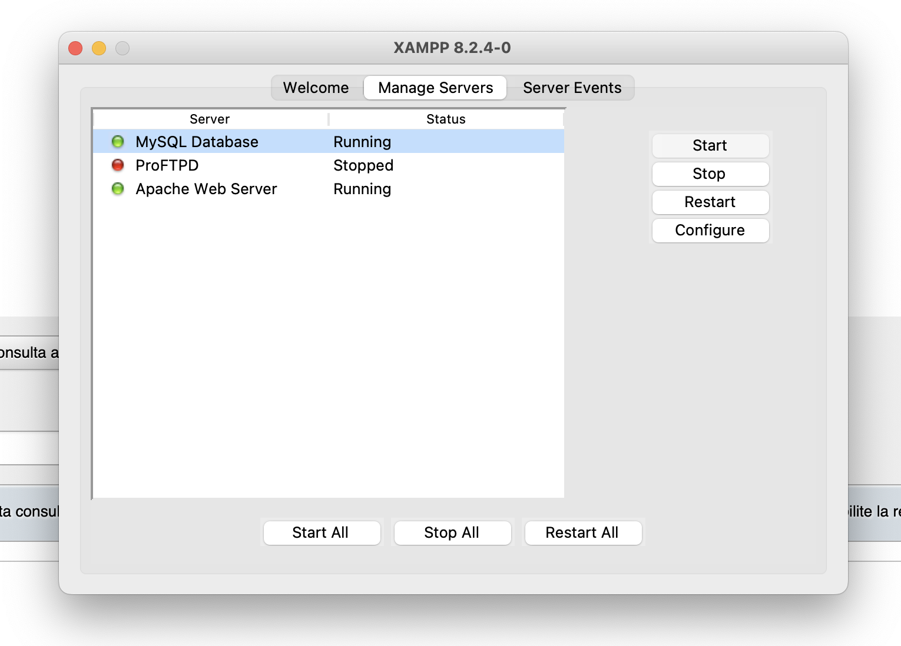
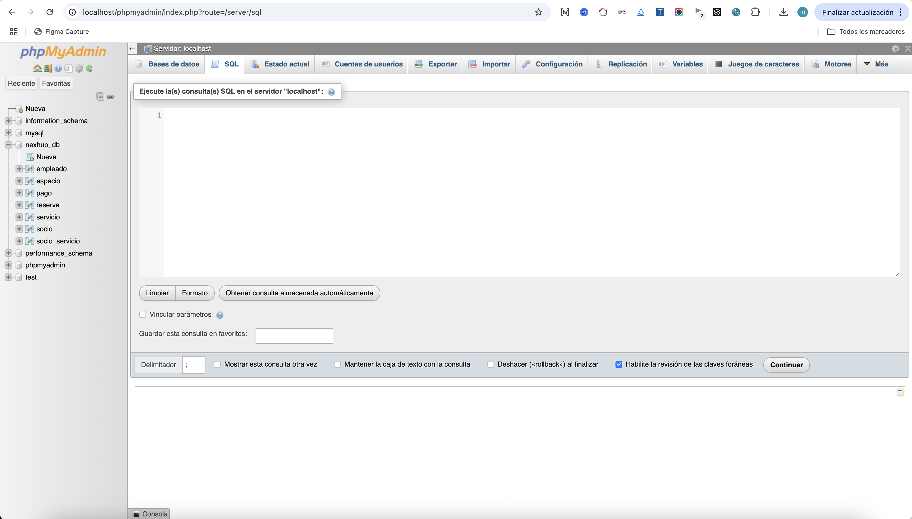
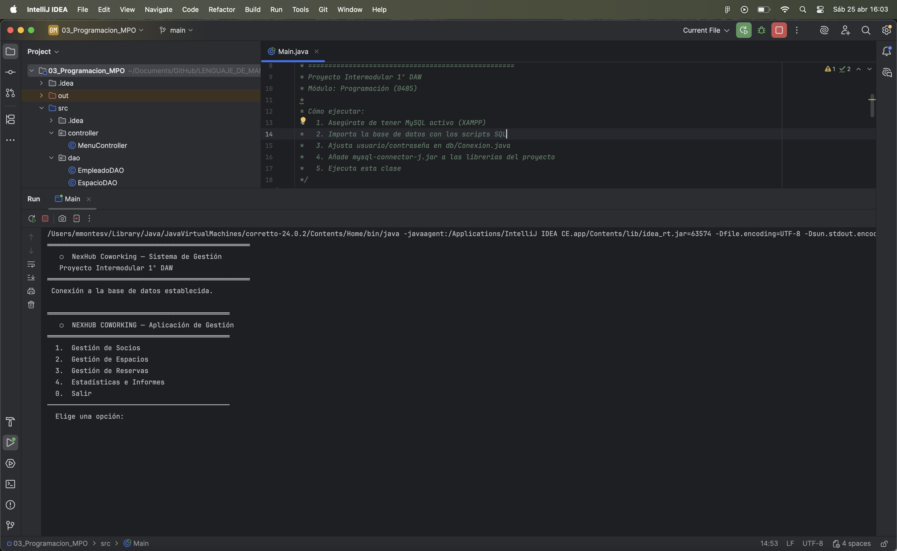
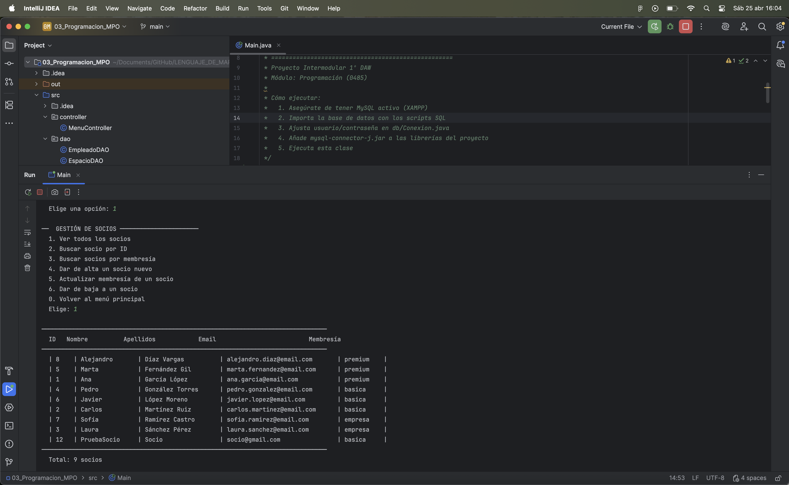

<div align="center">

<svg width="60" height="60" viewBox="0 0 32 32" xmlns="http://www.w3.org/2000/svg">
  <rect width="32" height="32" rx="6" fill="#0a0b0f"/>
  <polygon points="16,4 26,9.5 26,22.5 16,28 6,22.5 6,9.5" fill="#6c63ff" opacity="0.18"/>
  <polygon points="16,4 26,9.5 26,22.5 16,28 6,22.5 6,9.5" fill="none" stroke="#6c63ff" stroke-width="1.5"/>
  <text x="16" y="21" text-anchor="middle" font-family="Segoe UI,sans-serif" font-size="13" font-weight="800" fill="#6c63ff">N</text>
</svg>


# Presentación del Proyecto

**NexHub Coworking · Proyecto Intermodular · Miguel Montes Vicente  · 1º DAW · 2026**

</div>

---

## Qué es NexHub

NexHub es una plataforma de gestión para un coworking tecnológico ficticio en Madrid. El proyecto tiene tres partes que trabajan juntas: una web pública para los clientes, una aplicación Java para el administrador y una base de datos MySQL que las conecta.

No es un ejercicio genérico. Está modelado como si fuera un encargo real: la empresa tiene nombre, dirección, precios concretos y un flujo de trabajo que tiene sentido. El administrador puede dar de alta socios, crear reservas, registrar pagos y consultar estadísticas.

```
Web pública  ←——→  App Java  ←——→  MySQL (nexhub_db)
  (cliente)         (admin)         (datos)
```

---

## El problema que resuelve

Sin una herramienta de gestión, el administrador de un coworking lleva socios y reservas en papel o en una hoja de cálculo. Eso funciona con diez socios. Con ciento veinte ya no.

NexHub automatiza lo esencial: saber qué espacios están disponibles en un momento dado, registrar una reserva con su precio calculado automáticamente y mantener un historial de pagos organizado.

---

## Para quién está pensado

**El administrador del coworking** usa la aplicación Java desde consola para gestionar el día a día: socios, espacios, reservas y empleados.

**Los clientes potenciales** visitan la web para ver los espacios disponibles, los precios de cada plan y ponerse en contacto.

---

## Tecnologías utilizadas

| Capa | Tecnología | Por qué |
|------|-----------|---------|
| Frontend | HTML5, CSS3, JavaScript | Sin frameworks: el módulo evaluaba el dominio del lenguaje base |
| Backend | Java 24, JDBC | Lo que se trabaja en el módulo de Programación |
| Patrón | DAO (Data Access Object) | Separa el SQL de la lógica de negocio |
| Base de datos | MySQL con XAMPP | La base de datos del curso |
| Versiones | Git y GitHub | Control de cambios y entrega |

El stack no es el más moderno posible, pero es el que toca aprender este año y el que permite demostrar que se entiende cómo funciona cada capa.

---

## Arquitectura — patrón DAO

El código está separado en capas con responsabilidades bien definidas:

```
MenuController  →  Service  →  DAO  →  MySQL
   (input)         (lógica)   (SQL)
```

- El **controlador** recibe lo que escribe el usuario y llama al servicio.
- El **servicio** valida los datos y aplica las reglas de negocio.
- El **DAO** ejecuta el SQL y devuelve objetos.
- El **modelo** contiene las entidades con su propia lógica (`calcularPrecio()`, `esValida()`).

Cada clase tiene una sola responsabilidad y no sabe nada de las demás.

---

## Qué sé hacer gracias a este proyecto

- Diseñar un modelo de datos desde el diagrama E-R hasta las tablas SQL con claves foráneas.
- Conectar Java a MySQL con JDBC usando el patrón DAO.
- Aplicar herencia en Java con clases abstractas (`Persona → Socio / Empleado`).
- Implementar interfaces genéricas (`CrudService<T, ID>`).
- Construir una web responsive en dark mode sin frameworks, con animaciones CSS y validación JavaScript.
- Documentar un proyecto de forma que otra persona pueda ejecutarlo sin preguntar nada.
- Usar Git con commits descriptivos y estructura de repositorio organizada por módulo.

---

## Portfolio

| Qué | Cómo verlo |
|-----|-----------|
| Web | Doble clic en `02_Lenguaje_de_Marcas/index.html` — sin servidor |
| App Java | `Main.java` desde IntelliJ con XAMPP activo |
| Base de datos | Importar `04_Base_de_Datos/sql/nexhub_db.sql` en phpMyAdmin |
| Diagramas E-R | `04_Base_de_Datos/diagramas/` — abrir con app.diagrams.net |
| Código fuente | `github.com/mmontes-vicente/Proyecto_Intermodular_1-DAW` |

---

## Capturas del sistema funcionando

### 1. XAMPP activo

MySQL Database y Apache Web Server en estado Running.



---

### 2. Base de datos nexhub_db en phpMyAdmin

Las 7 tablas del proyecto visibles en el panel izquierdo: empleado, espacio, pago, reserva, servicio, socio, socio_servicio.



---

### 3. Estructura de la tabla socio

7 campos: id_socio (PK, AUTO_INCREMENT), nombre, apellidos, email (UNIQUE), telefono, fecha_alta y tipo_membresia.


---

### 4. Datos de la tabla socio

8 socios con distintos tipos de membresía: premium, basica y empresa.


---

### 5. Consulta JOIN en phpMyAdmin

Resultado de la consulta que une las tablas reserva, socio y espacio ordenado por fecha de inicio descendente.


---

### 6. Menú principal de la aplicación Java

La aplicación arranca, establece la conexión con nexhub_db y muestra el menú principal con las cuatro opciones de gestión.



---

### 7. Listado de socios desde consola

El administrador entra en Gestión de Socios y ejecuta Ver todos los socios. La aplicación consulta MySQL y muestra los 9 registros en tabla.



---

### 8. Web en el navegador

La página de inicio de NexHub abierta en Chrome directamente desde el archivo `index.html`, sin servidor.


